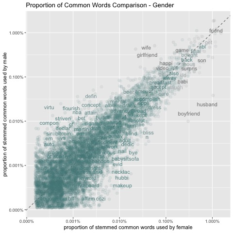
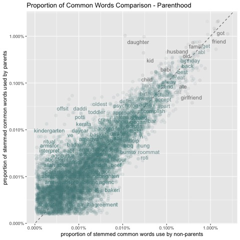
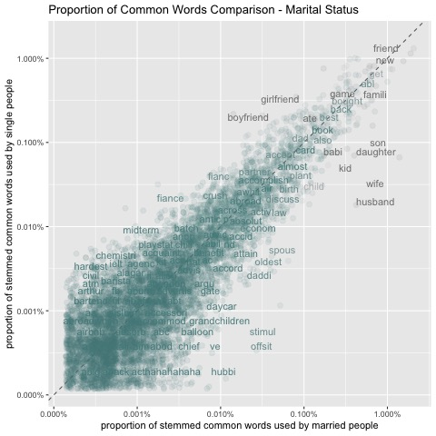
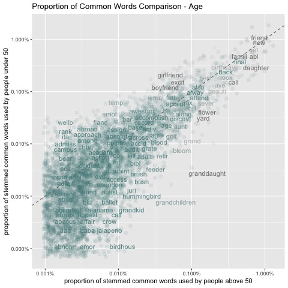
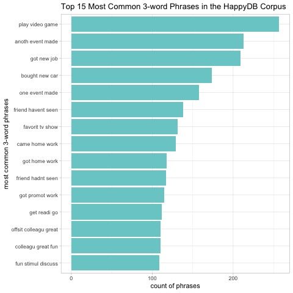

# Applied Data Science @ Columbia
## Fall 2018
## Project 1: What made you happy today?


### [Project Description](doc/)
This is the first and only *individual* (as opposed to *team*) this semester. 

HappyDB is a corpus of 100,000+ crowd-sourced happy moments. The goal of the corpus is to advance the state of the art of understanding the causes of happiness that can be gleaned from text. Rit-public conducted a large scale collection of happy moments over 3 months on Amazon Mechanical Turk (MTurk.) For every task, they asked the MTurk workers to describe 3 happy moments in the past 24 hours (or past 3 months.) This report aims to extract interesting finds from HappyDB using data science methods.

Term: Fall 2018

+ Projec title: Data Story of Happy Moments

+ This project is conducted by [Ruoxi Bai]

+ Project summary: [a short summary] This project uses data science methods to find an underlying story behind the happyDB corpus. First take a look at high frequency words in general and in different demographic or survey categories. Then read into common trigram phrases appeared in the corpus. At last, apply sentiment analysis to capture emotional structure behind the corpus.

Following [suggestions](http://nicercode.github.io/blog/2013-04-05-projects/) by [RICH FITZJOHN](http://nicercode.github.io/about/#Team) (@richfitz). This folder is orgarnized as follows.

```
proj/
├── lib/
├── data/
├── doc/
├── figs/
└── output/
```
## Part 1: single words

First, let's take a look at single words in the corpus.

### What happy moments are people generally talking about?

Let's take a look at the most frequently used words. Friendship is mentioned most often, it even exceeds work and family.


### What males and females think of when talking about happy moments?

+ Family words such as "baby" and "children" are frequently mentioned in happy memories, and females tend to mention them slightly more. It is interesting that the word "mama" brings more joy to females than it to males and the word "papa" to both, which shows an obvious bond between mothers and kids.

+ Words related to spouses are mentioned quite frequent.

+ Both female and male share some common topics that make them happy, such as "birthday", "friend". Some frequent words mentioned in happy moments are consistent with hobbies. Such as "makeup", "crochet" to female and "nba", "bike" to male.



### What parents and non-parents think of when talking about happy moments?

+ In genral, when people thinking about happy moments, they think of someone around them. For parents, family members are frequently mentioned in happy moments. This is connected with the findings in step3 that people like to mention families in happy moments. And for those that are not a parent, they frequently someone like roommates.

+ There is a pattern of time allocation difference between this two groups. For parents, kids related topics ("birth", "kindergarten") are mentioned more frequently, while for the other group, recreationary activities ("bbq", "guitar") are mentioned more.



### What married ones and single ones think of when talking about happy moments?

+ Not suprisingly, for married people, "husband", "wife" and "spouse" are mentioned more frequently, while for single people, "girlfriend", "boyfriend" and "fiance" are.

+ As marital status is closely related to parenthood, for the married ones, kids are also mentioned much more common.



### What people with different ages think of when talking about happy moments?

+ There is a pattern that people across different ages pay attention and enjoy different things. For those over 50, they enjoy the nature more (supporting words including "flower", "yard", "bird"). For those under 50, they enjoy human activity more (supporting words including "bar", "game").

+ One interesting thing is that people under 50 are more like to use strong words to express their happiness (such as "amazing", "awesome", "absolute") compared with people over 50.



### What people think of happy moments in the past 24 hours or the past 3 months?

+ Under a 3-month reflection period, people tend to mention important events that do not happen very often, such as Valentine's Day, graudation, etc. Under a 24 hours reflection period, people tend to mention things that are used in daily life, such as coffee, bed.

+ One interesting thing is that people mention foods (for example, coffee, cookie, bun) much more often when the reflection period is short.


## Part 2: phrases

Now, let's get more information on the sentences by reading some high frequency trigram phrases.

### What type of things are people talking about in happy moments?

+ Recreationary events are pleasant. They are motioned most frequently in happy moments.

+ People love new things. The second most mentioned things are new items or environment. It looks like changes really fresh people's mind and make them happy.

+ Good things happened at work or school are also a major contributor to happiness.



## Part 3: emotions behind words and sentences

Finally, let's dig deeper in the corpus and find the emotional structure of it.

### What emotions are contained in separate words?

+ All the words associated with postive emotions (anticipation, joy, surprise, trust) obviously appear more frequently than those associated with negative emotions (anger, disgust, fear, sadness). This is not surprising because we are dealing with happy moment sentences.

+ When talking about happy moments, people tend to recall those situations that make them feel pure joy. Emotions related to anticipation, trust and surprise are less mentioned, even though they are positive and can be pleasant as well.


### What emotions are contained in sentences?

+ Obviously, the nagative emotions are used much less compared to positive ones

+ Compared to other positive emotions, "surprise" contributes much less to people's happiness. It looks like people usually do not mention surprising moments when they recall happy times.


**[Project Report](https://github.com/TZstatsADS/Fall2018-Proj1-RxBai/blob/master/doc/Project1Submission.html)**

**Citation: Happy DB**

Akari Asai, Sara Evensen, Behzad Golshan, Alon Halevy, Vivian Li, Andrei Lopatenko, 
Daniela Stepanov, Yoshihiko Suhara, Wang-Chiew Tan, Yinzhan Xu, 
``HappyDB: A Corpus of 100,000 Crowdsourced Happy Moments'', LREC '18, May 2018.
